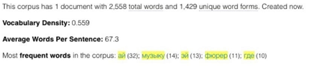

# Cравнительный анализ творчества оксимирона и хаски
Проанализировав тексты песен двух исполнителей, мы заметили, что, несмотря на то, что у Хаски слов в альбоме меньше почти в два раза, количество оригинальных словоформ у него почти равное с Оксимироном. Что подтверждает информацию, полученную в AntConc.

Оксимирон
Хаски

Получив данные о самых популярных словах: 

Оксимирон
Хаски

Мы преступили к анализу употребляемости самых популярных у этих исполнителей слов: 
## Оксимирон

### Хаски

Стоит обратить внимание на контекст некоторых слов: 

У Хаски бит используется в значении: такт в музыке, употребляеся в выражении англ. beat per minute, bpm — ударов в минуту. 

У Хаски: графическое изображение пользователя, его игрового персонажа.
По вышеприведенным графикам становится понятно, что лексика Оксимирона либо более употребительна в прошлых века, либо ее употребительность не сильно изменилась с течением времени. Хаски же использует куда более популярную в последнее время лексику, либо же и вовсе употребляет неологизмы (кибераноним).  

